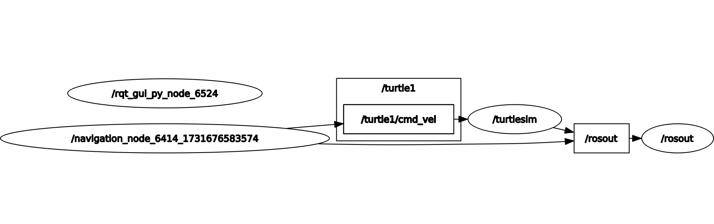

# PDE4430 MOBILE ROBOTICS – COURSEWORK 1 - ROS TURTLESIM 🐢

This repository hosts the source code for the `turtlesim_coursework` package, which implements five main tasks with the turtle in a ROS Noetic Turtlesim environment:

- **Teleoperation using the keyboard** with an option to change movement speed.
- **Autonomous navigation** to any given coordinate in the Turtlesim window.
- **Wall collision avoidance**: Overrides movement to prevent wall collisions.
- **Vacuum cleaning behavior**: Covers the entire window area efficiently.
- **Multiple turtles vacuum cleaning behavior**.
## Prerequisites:
1. ROS installed and configured.
2. Python 3 with `rospy`, `geometry_msgs`,`math`, and `pynput` libraries installed.
3. Start the ROS master (run `roscore`).
4. Run the turtlesim_node in a new terminal:
   ```bash
   rosrun turtlesim turtlesim_node
5. Once the roscore and turtlesim is set up, the python file associated with a task can be run on another terminal.

## TASK 1: Teleoperation with Adjustable Speed

**Aim**: Control the turtle's movement using arrow keys (forward, backward, left, right) and adjust the speed dynamically using the `+` and `-` keys on the keyboard.

### Design

The program mainly consists of a listener and a publisher.  

1. **Listener - Captures the Key Presses**:
   - The listener runs its own thread in the background to capture keyboard events. It is designed to listen and update the publisher about the turtle's speed and direction.

2. **Publisher Node - Turtle Movement**:
   - The ROS node continuously publishes velocity values from the listener to the `/turtle1/cmd_vel` topic, controlling the turtle's movement.

### Algorithm

1. **Initialize**:
   - Import necessary dependencies: `pynput` for key press detection and `rospy`/`geometry_msgs` for ROS functionality.
   - Pynput has classes such as the `Listener`, `Key`, and `KeyCode` that help detect the key pressed by checking the attributes of the key.
2. **Set Speed Variable**:
   - Define a global `speed` variable to control movement speed, adjustable by keyboard input.
3. **Keyboard Listener**: Requires the `on_press(key)` and `on_release(key)` functions which are then defined.
   - **`on_press(key)`**: Detects specific key presses uses the following keys:
     - **Arrow keys** for movement.
     - **+** and **-** to adjust speed.
     - **Esc** to stop teleoperation and shut down the ROS node.
   - **`on_release(key)`**: Stops movement by setting the velocity to zero.
4. **Continuous Publish**:
   - Run a loop to publish updated `Twist` messages to `/turtle1/cmd_vel` at 10 Hz until the node is stopped.
5. **Shutdown**:
   - Stop the listener when `Esc` or `Ctrl+C` is pressed.
6. Implement `try` and `except` blocks for graceful exit.

### Architecture

The `RQT` graph is shown below.


- **Node**: `teleop`
- **Topic**: `/turtle1/cmd_vel`
-**Functions**:
- **`on_press(key)`**: Handles key presses for direction and speed control.
- **`on_release(key)`**: Stops the turtle when keys are released.
- **`teleoperation()`**: Initializes the ROS node, keyboard listener, and publishing loop. It is then called in the 'main' block.
**Global Variables**:
- `speed`: Adjusts the linear speed of the turtle, modifiable by `+` and `-` keys.

### Flow of Information

-User presses arrow key→ key captured → twist message updated to a non-zero value (new speed can be seen on the terminal)→ publish twist to `cmd_vel` topic → Turtle moves.  
-User presses `+` or `-`→ key captured → speed incremented (twist message also updated) → publish twist → turtle moves faster or slower.  
-user releases arrow key → key captured → twist set to zero (seen on terminal) → publish twist → turtle stops.  


## Running the Project

### Steps to Run:
1. Run the teleoperation node in a new terminal:
   ```bash
   rosrun turtlesim_coursework teleop_with_speed.py
2. Follow the on-screen instructions in the terminal to control the turtle. Press `esc` to quit.

## Future Debugging
On pressing the Esc key, random terminal commands may appear, even though the node stops successfully.

## TASK 2: Autonomous navigation to a given coordinate

The goal is to create a ROS node that moves the turtle to a user-defined coordinate within the Turtlesim window.

### Design

The program consists of a custom node named `navigation_node` that acts as both subscriber and publisher. It:
- **Subscribes** to the topic `/turtle1/pose` for receiving the turtle's current position and orientation.
   - The subscriber 'Callback' plays a key role here. It gets called continously as Pose messages are updated, essentially acting as a 'loop'. 
   - Since the callback function has access to the `Pose` values, these values are obtained, processed and published in the callback itself.
- **Publishes** to the topic `/turtle1/cmd_vel` velocity commands to control the turtle's movement.

The program is structured to:
  - Rotate the turtle to face the target coordinate.
  - Move it forward until it reaches the destination.
  - Stop the turtle upon arrival.


### Algorithm

1. Initialize the ROS node, publisher, and subscriber.
2. Prompt the user for the target coordinates `(x, y)`.
   - The input() function takes the user input as a string, which is split using split() function and then mapped to two separate float values.
3. Calculate:
   - The angle to the target (`angle_to_target`) using the `math.atan2` function in python. This returns the angle of the user-coordinate with respect to the x-axis.
   - The distance to the target (`distance_to_target`) using the formula for Euclidean distance.
4. Rotate the turtle toward the target:
   - Use angular velocity commands until the alignment threshold (difference between the angle to target and the current orientation) is met.
   - Set a flag (`rotation_done`) once the rotation is completed, so that the callback does not repeat the rotation check.
5. Move the turtle forward:
   - Use linear velocity commands until the distance threshold is met.
   - Set a flag (`linear_done`) to remind the callback that the linear movement is to be terminated. Since the callback starts a fresh thread each time, it has no memory of the previous state causing it to recheck. Flags come in handy here.
6. Stop the turtle and shut down the node.

### Architecture

The `RQT` graph displays the main components:


- **Input**: User-provided target coordinates `(x, y)`.
- **Node**: `navigation_node`.
  - **Publishes**: `/turtle1/cmd_vel` (velocity commands).
  - **Subscribes**: `/turtle1/pose` (current turtle pose).


**Functions**:
- **`callback(pose)`**: Invoked as a pose message is updated.
- **`subscriber`**: Called in the 'main' block.

**Global Variables**:
- `Twist`- for command velocity
- `rotation_done` and `linear_done` act as state flags.

### Flow of Information

  Input coordinates → Callback invoke on every new pose message → Compute angular alignment and distance using callback and input → Rotation if condition met → Set Flag once rotated → check for Linear motion using condition → Set Flag once moved → Stop.


## Running the Project

1. Run the navigation node in a new terminal:
   ```bash
   rosrun turtlesim_coursework navigate_to_coordinate.py
2. Follow the instructions on the terminal.

## Future Debugging
For some coordinates, the turtle is not able to instantaneously stop and it continues to move. Yet to debug this issue. Let me know if you can help!

## TASK 3: Avoiding a wall collision

**Aim**: To move the turtle within the Turtlesim Window without colliding with the actual boundary of the Turtlesim window.


### Design

The program mainly consists of a custom node that acts as listener, subscriber and a publisher at the same time, where:

1. **Listener - Captures the Key Presses**:
   - To move the turtle within the window, the keys `w`, `a`, `s` and `d` are used.
2. **Subscriber Node - Updated Pose**
   - The callback function is called every time a new pose is updated to the listener so that the boundary check is also updated. 
2. **Publisher Node - Turtle Movement**:
   - The ROS node continuously publishes velocity values from the listener to the `/turtle1/cmd_vel` topic, controlling the turtle's movement.

### Algorithm

1. **Initialize ROS Node**  
   - Create a ROS node called `listener_node`.
   - Set up publishers and subscribers for Turtlesim topics.

2. **Keyboard Listener**  
   - Use the `pynput` library to capture key presses:
     - `w` - Move forward.
     - `s` - Move backward.
     - `a` - Rotate left.
     - `d` - Rotate right.

3. **Pose Updates**  
   - THe same node continuously subscribe to `/turtle1/pose` topic to get the turtle's position.

4. **Boundary Check**  
   - If the turtle’s position exceeds boundaries i.e 1.6 < x <9.4 and 1.6< y <9.4, 
     - Stop linear motion.
     - Allow only corrective motion (e.g., `w` or `s` to re-enter bounds). This is checked using the key that was last pressed. 
     

5. **Publish Commands**  
   - Publish `Twist` messages to `/turtle1/cmd_vel` to move the turtle.

6. **Stop Movement on Key Release**  
   - Reset velocities when the key is released.

### Architecture

The `RQT` graph is shown below.


- **Node**: `wall_avoidance` - capture key presses, update pose, publish velocity commands.
- **Topic**: 
   - `/turtle1/cmd_vel` (published by wall_avoidance node)
   - `/turtle1/pose` (subscribed by wall_avoidance node)
-**Key Functions**:
- **`on_press(key)`**: Handles key presses for direction and speed control.
- **`on_release(key)`**: Stops the turtle when keys are released.
- **`wall_avoidance()`**: Initializes the ROS node, callback function for subscriber keyboard listener, and publishing loop. It is then called in the 'main' block.
- **Global Variables**:
- `pose`
- `twist`
- `last-pressed key`

### Flow of Information

-User presses key→ key captured by listener → Boundary check → if within bounds execute regular teleoperation with key 'w', 'a', 's', and 'd'. When turtle hits boundary, it is rotated back in enabling only 'w' and 's' key based on last pressed logic → once back in checks for boundary again..and so on.


## Running the Project

### Steps to Run:
1. Run the listener_node in a new terminal besides the `roscore` and `turtlesim_node`:
   ```bash
   rosrun turtlesim_coursework wall_avoidance.py
2. Follow the on-screen instructions in the terminal to move the turtle.


